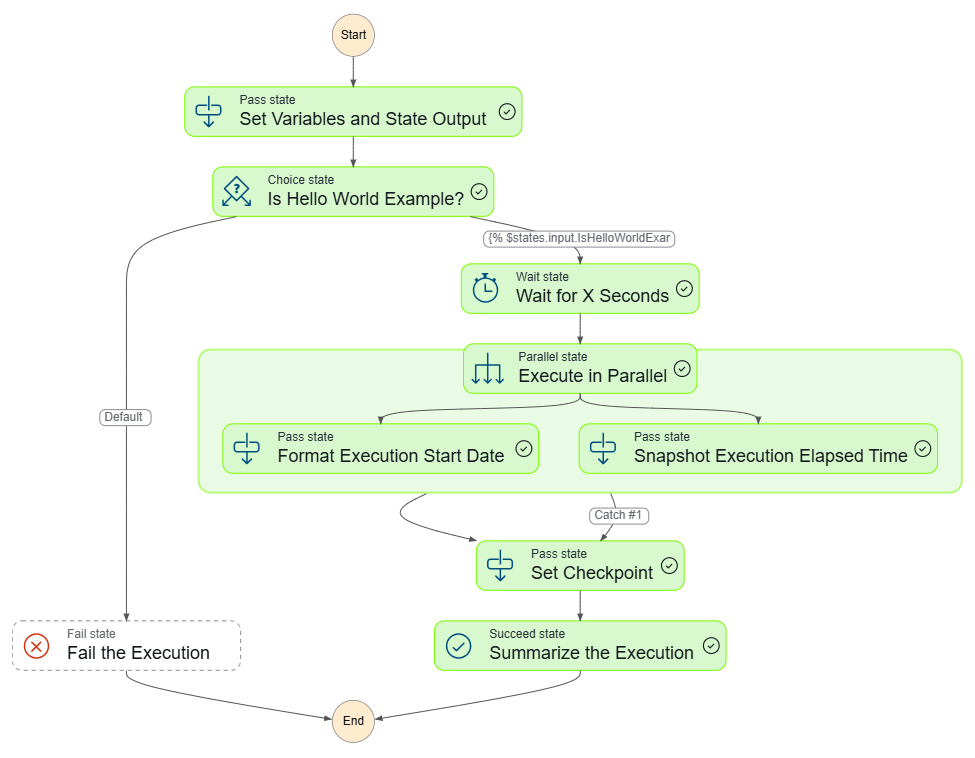
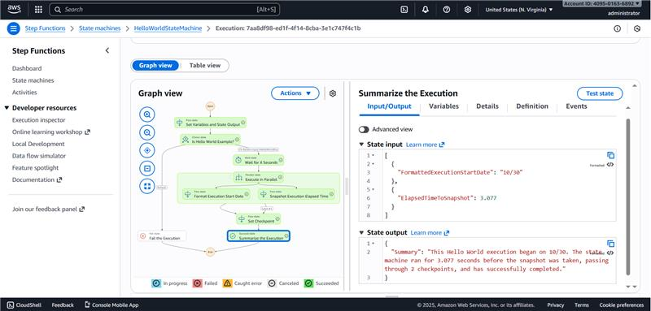

# aws-stepfunctions-desafio

Este repositório foi criado como parte do desafio **"Explorando Workflows Automatizados com AWS Step Functions"** da DIO.

## Objetivo do Desafio

Consolidar os aprendizados sobre **orquestração de serviços com AWS Step Functions**, criando um fluxo de trabalho automatizado e documentando o processo de forma técnica e organizada.

## O que é o AWS Step Functions?

O **AWS Step Functions** é um **serviço de orquestração de fluxos de trabalho** que facilita a **coordenação de aplicações e microsserviços**.  
Ele permite criar **workflows visuais**, conectando serviços da AWS como **Lambda, S3, DynamoDB, SNS, SQS**, entre outros.

Na prática, ele atua como um **“condutor”**, que gerencia a ordem de execução e as dependências entre diferentes tarefas automatizadas.

---

##  Experimento realizado

Durante o laboratório, foi criada a **State Machine "HelloWorldStateMachine"**, oferecida como modelo na AWS.  
Esse fluxo executa uma tarefa simples, mas ajuda a compreender os conceitos principais:

- Estados (`States`)
- Transições (`Next` / `End`)
- Execuções (`Execution`)
- Logs e monitoramento automáticos

O exercício também mostrou que:
- É possível **criar o Step Functions antes dos recursos** (como Lambdas ou S3), e adicionar as referências posteriormente.  
- O serviço atua como **orquestrador de serviços**, permitindo **reuso, controle e automação** em arquiteturas distribuídas.

---

##  Ideia adicional: duas funções Lambda

Para fixar o aprendizado, também foi considerada uma ideia de exemplo com duas funções Lambda:

1. **PrimeiroLambda** → executa uma mensagem inicial  
2. **SegundoLambda** → finaliza o fluxo com uma resposta

O fluxo seria: PrimeiroLambda → SegundoLambda → Fim

##  Prints da Execução

### Diagrama Visual

### Resultado da Execução

---

##  Conclusão

A prática reforçou os principais conceitos de workflows na AWS:

✅ O Step Functions é um **orquestrador visual** que facilita a coordenação entre serviços.  
✅ Podemos **modelar fluxos complexos** sem precisar gerenciar infraestrutura.  
✅ O serviço permite **automatizar processos**, **monitorar execuções** e **centralizar logs** de forma eficiente.  
✅ O **modelo visual** ajuda a compreender o comportamento do sistema de ponta a ponta.

##  Referências

- [Documentação Oficial - AWS Step Functions](https://docs.aws.amazon.com/step-functions/)
- [DIO - Bootcamp Code Girls](https://www.dio.me/)
